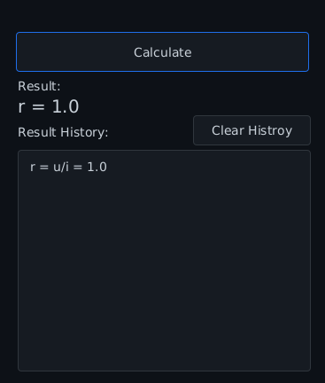

# Projektübersicht

## Einleitung
- Dieses Projekt wurde im Rahmen einer Hausarbeit erstellt. 
- Ich werde keine Issues Beantworten/Pull requests Akzeptieren  
- Es steht unter der MIT License. 
- Die Aufgabe bestand darin ein Programm zu schreiben, was mit diversen Formeln aus der Vorlesung "Elektrotechische Grundlagen" rechenen kann und nützliche Informationen zu ihnen anzeigt. 
- Das Ziel besteht darin gelernte Formeln besser zu verstehen und ein nützliches Tool dabei zu schreiben.
## Voraussetzungen
- **Java-Version 22** (WICHTIG: Das Programm funktioniert **NICHT** mit älteren Versionen)
- **IntelliJ IDEA** (Ultimate oder Community Edition)
- **Internetverbindung** (Einige Abhängigkeiten werden durch Maven aus dem Netz geladen)
- **Betriebssystem:** Linux(getestet), Windows (getestet), OSX (nicht getestet) 

## Installation

1. **IntelliJ IDEA herunterladen:**
  - Besuche die offizielle Seite: [IntelliJ IDEA Download](https://www.jetbrains.com/idea/download/?section=windows)
  - Lade entweder die Ultimate oder die Community Edition herunter.

2. **Projekt einrichten:**
  - Entpacke das heruntergeladene ZIP-Archiv.
  - Wähle den entpackten Ordner in IntelliJ IDEA als Projektordner aus.

3. **Java-Installation:**
  - IntelliJ IDEA erkennt und installiert automatisch die erforderliche Java-Version.
  - wenn nicht Java 22 manuell installieren

4. **Projekt ausführen:**
  - Navigiere in IntelliJ IDEA zu `Main.java`. (src/main/java/com/example/elektrocalc/Main.java)
  - Drücke `Umschalt + F10` oder klicke auf das grüne "Play"-Symbol, um das Programm zu starten.

## Aufbau der Applikation

### Benutzeroberfläche (GUI)

### Anwendungsansicht
Hier ist ein Screenshot der Applikation:


### Erklärung
- In der oberen Combo Box wird die Formel ausgewählt!


- nach dem Auswählen wird das gui angepasst / Formel, Definition, GUI Elemente und Bild erscheinen
- man wählt nun die zu berechnende Variable aus durch clicken des Radiobuttons


- man trägt die werte bei den anderen Variablen ein und clickt auf den Großen calculate Button das Ergebnis erscheint einmal in Result und einmal in Histroy


### Icon der Applikation
- Das folgende Bild zeigt das handgezeichnete Icon der Applikation, welches im "Icon Tray" schnell zu finden ist.


### Schaubilder
- alle Bilder sind handgezeichnet in Figma und Krita
- Das folgende Bild zeigt eins handgezeichnetes Schau bilder: 


# Erweitern und Modifizieren

### Formeln oder Einheiten hinzufügen
- Die Formeln werden im JSON-Format gespeichert.
- Es ist wichtig, das vorgegebene Format strikt einzuhalten, um Fehler zu vermeiden, insbesondere wenn die Formelsammlung erweitert werden soll.

### Beispiel einer gespeicherten Formel (`equations.json`):
```json
{
  "Test": {
    "equation": "zc == -j * 1/((2*Pi*f)*c*c)",
    "definition": "Test",
    "image": "cat.png"
  }
}
```
## Formeln hinzufügen
- **Formatierung:** Formeln müssen das Gleichheitszeichen `==` verwenden und dürfen maximal 7 Variablen enthalten (aufgrund der Einschränkungen der GUI).
- **Kleinbuchstaben:** Alle Formelzeichen müssen in Kleinbuchstaben geschrieben werden, da die Symja-Bibliothek reservierte Zeichen enthält, die nicht gefiltert werden können. Dies sorgt für Einheitlichkeit.
- **Erlaubte Funktionen:** Du kannst `pi`, `sqrt`, `tan`, `cos`, `arctan` etc. verwenden.
- **Definitionen:** Definitionen müssen ein durchgehender, langer String sein.
- **Bild:** Das Bild muss im Verzeichnis `com.example.elektrocalc` liegen und der Bildname muss vollständig und korrekt angegeben werden.

## Einheiten und deren Zugehörigkeit

Die Einheiten und ihre Zuordnung sind in der Datei `units.json` definiert:

```json
{
  "i": {
    "unit": "A",
    "name": "Ampere"
  },
  "q": {
    "unit": "C",
    "name": "Coulomb"
  }
}
```
- Der Key `unit` entspricht den Variablen in den Formeln.
- Der Key `name` enthält den vollständigen Namen der Einheit. (Wird nicht genutzt)

## Programmcode Modifizieren
- zur Entwicklung [Intellij Idea](https://www.jetbrains.com/idea/download/?section=windows) 
- zur GUI Entwicklung [Scenebuilder](https://gluonhq.com/products/scene-builder/) mit dem die `app.fxml` modifiziert wird
### Klassen Struktur
  Alle Klassen sind im Code Kommentiert
- **Main**: Ist der Entry Point und enthält Einstellungen für die Application wie was für ein Icon es hat
- **Controller**: Ist zum Manipulieren des GUIs und alle Button aktionen zuständig
- **DataProcessor**: Ist zum Formatieren der Daten in bestimmte Strukturen zuständig damit sie Verarbeitet werden können
- **Json**: liest die json Datein an und hat vorgefertigte function um die Daten zu extrahieren
- **EquationSolver**: stehlt die Formeln um / Rechnet mit diesen
- **UIElementMap**: ist eine Art Hashmap die GUI Elemente zusammen Mapped

# Abhängigkeiten der Applikation
Es handelt sich um ein `Maven Projekt`
Die Applikation nutzt die folgenden Abhängigkeiten, die in der `pom.xml` aufgelistet sind:

- **org.json**: Für die Verarbeitung und Nutzung von JSON-Dateien.
- **org.matheclipse (Symja)**: Zum Interpretieren und Umstellen von Formeln.
- **io.github.mkpaz (atlantafx-base)**: Für fertige Themes der App.
- **org.openjfx (JavaFX)**: Für alle GUI-Elemente. 
  - das Layout **javafx-fxml**


